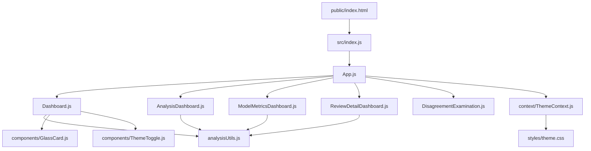

# DESCRIPTION

This dashboard is designed for visualizing and analyzing sentiment data derived from review datasets. The application reads CSV files stored in the **public** directory, processes the data using custom analysis utilities, and displays the results using a series of interconnected React components.

The architecture is modular:
- **Data Ingestion:** CSV files (e.g., reviews.csv) are provided as static assets in the **public** folder.  
- **Bootstrapping:** The application starts at **public/index.html**, which loads **src/index.js**. This initializes the React application.  
- **Application Core:** The main entry component located in **src/App.js** orchestrates routing and state management.  
- **Dashboards & Components:**  
  - **src/Dashboard.js**, **src/AnalysisDashboard.js**, **src/ModelMetricsDashboard.js**, and **src/ReviewDetailDashboard.js** each render specialized views.  
  - **src/DisagreementExamination.js** provides additional insights by comparing different sentiment outputs.  
  - Reusable UI components such as **src/components/GlassCard.js** and **src/components/ThemeToggle.js** form the building blocks of the interface.  
- **Utilities and Context:**  
  - Functions in **src/analysisUtils.js** perform data processing and sentiment calculations.  
  - Shared state and theming are managed via **src/context/ThemeContext.js** (supported by styles in **src/styles/theme.css**).

This structure allows for a clear separation of concerns, ensuring that data processing, UI rendering, and state management are each handled independently and efficiently.

# INSTALLATION

1. **Clone the Repository**:
   ```bash
   git clone <repository-url>
   ```
2. **Install Dependencies**:
   ```bash
   npm install
   ```
3. **Prerequisites**:  
   - Ensure you have Node.js (version 14 or higher) installed.  
   - Familiarity with npm and modern JavaScript/React tooling is recommended.

# EXECUTION

1. **Run the Development Server**:
   ```bash
   npm start
   ```
   This command launches the dashboard locally. Once the server starts, open the provided localhost URL in your browser to interact with the application.

2. **Running Tests**:  
   If you wish to run tests, execute:
   ```bash
   npm test
   ```

# SYSTEM WORKFLOW DIAGRAM



This diagram highlights:
- **Application Initialization:** The process begins at **public/index.html**, triggering **src/index.js** to bootstrap the app.  
- **Component Structure:** **App.js** acts as the central hub, delegating rendering to various dashboard components.  
- **Data Processing:** Utility functions in **analysisUtils.js** are invoked by multiple dashboards to perform sentiment analysis.  
- **UI Components & Theming:** Reusable components for UI and theme management ensure a consistent user experience throughout the application.
