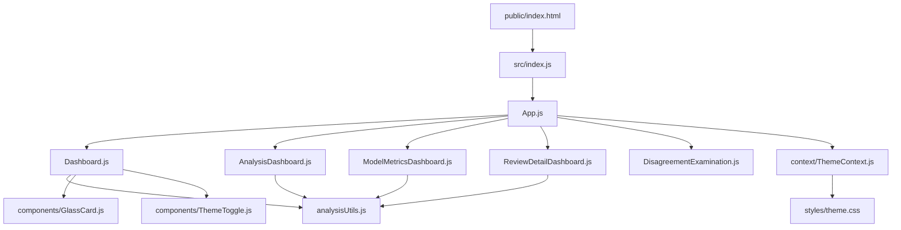

# Introduction

This dashboard is designed for visualizing and analyzing sentiment data derived from review datasets. The application reads CSV files stored in the **public** directory, processes the data using custom analysis utilities, and displays the results using a series of interconnected React components.

The architecture is modular, ensuring a clear separation of concerns:
- **Data Ingestion:** CSV files (e.g., reviews.csv) are placed in the **public** folder.
- **Bootstrapping:** The application starts at **public/index.html**, which loads **src/index.js**. This initializes the React application.
- **Application Core:** The main entry component located in **src/App.js** orchestrates routing and state management.
- **Dashboards & Components:**  
  - **src/Dashboard.js**, **src/AnalysisDashboard.js**, **src/ModelMetricsDashboard.js**, and **src/ReviewDetailDashboard.js** each render specialized views.  
  - **src/DisagreementExamination.js** provides additional insights by comparing different sentiment outputs.  
  - Reusable UI components such as **src/components/GlassCard.js** and **src/components/ThemeToggle.js** form the building blocks of the interface.  
- **Utilities and Context:**  
  - Functions in **src/analysisUtils.js** perform data processing and sentiment calculations.  
  - Shared state and theming are managed via **src/context/ThemeContext.js** (supported by styles in **src/styles/theme.css**).

# Prerequisites

- **Node.js** (version 14 or higher).
- **npm** (or yarn).
- Basic familiarity with React, CSV processing, and modern JavaScript tooling.

# Installation

1. **Clone the Repository**:
   ```bash
   git clone https://github.com/gustavorubim/sentiment-dashboard-f.git
   ```
2. **Install Dependencies**:
   ```bash
   npm install
   ```

# Data Setup

By default, reviews come in a ZIP file located in **public/reviews.zip**. Extract them using one of the following methods:

- **Linux/Mac**:
  ```bash
  cd public && unzip reviews.zip && cd ..
  ```
- **Windows (PowerShell)**:
  ```powershell
  cd public; Expand-Archive -Path reviews.zip -DestinationPath .; cd ..
  ```
- **Windows (Command Prompt)**:
  ```cmd
  cd public && tar -xf reviews.zip && cd ..
  ```

Make sure the CSV files (like `reviews.csv`) are now located directly in the **public** folder.

# Configuration

Currently, no special environment variables or extra setup steps are required. If you plan to integrate additional APIs or environment-specific features, consider adding them here.

# Development Usage

1. **Run the Development Server**:
   ```bash
   npm start
   ```
   After the server starts, open the provided localhost URL in your browser to interact with the dashboard.

2. **Running Tests**:  
   ```bash
   npm test
   ```
   This command runs the test suite.

# Production Build & Serving

1. **Create a Production Build**:
   ```bash
   npm run build
   ```
   This command generates an optimized production build in the **build** directory.

2. **Serve the Build Locally**:
   You can use a simple local server, for example:
   ```bash
   npx serve -s build
   ```
   Then visit the printed localhost URL in your browser.  
   Alternatively, you can host the **build** folder on any static web server or hosting platform.

# Troubleshooting / FAQs

- **CSV Not Found**: Ensure that the CSV files are correctly unzipped into the **public** directory.
- **Port Conflicts**: If `npm start` fails due to a port conflict, specify a different port or stop the service using that port.
- **Missing Node.js**: Verify that Node.js (v14+) is installed and added to your system’s PATH.
- **Build Issues**: Delete the **node_modules** folder and reinstall dependencies with `npm install` if you encounter unexpected build errors.
- Check the [React documentation](https://reactjs.org/) for common React-related issues.

# System Workflow Diagram



In this flow:
- **public/index.html** kicks off the app.
- **src/index.js** bootstraps React.
- **App.js** manages routing and state, delegating to individual dashboards.
- **analysisUtils.js** is called by multiple dashboards for sentiment processing.
- **ThemeContext.js** and **theme.css** handle theming.

# Contributing / License

- If you plan to submit improvements or bug fixes, please open a pull request or create an issue on the repository.
- If your organization uses a specific license, mention it here (e.g., MIT, Apache, etc.).

Thank you for using the Sentiment Dashboard! We hope this README helps you get started quickly.
